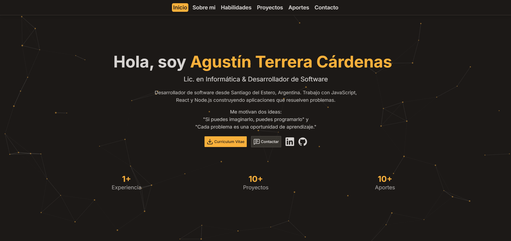

# React + Vite
# Portfolio Personal - Agustin Terrera Cárdenas

Portfolio profesional desarrollado con React, Vite y TailwindCSS. Diseñado para mostrar proyectos, habilidades y facilitar el contacto profesional.



🔗 **Live Demo:** [agustin-terrera.com](https://agustin-terrera.com)

---

## ✨ Características

- **Diseño Moderno:** Interfaz oscura con animaciones fluidas y efectos de partículas
- **Totalmente Responsive:** Optimizado para desktop, tablet y móvil
- **Navbar Dinámico:** Auto-hide al hacer scroll con detección de sección activa
- **Sistema de Modales:** Detalles de proyectos y aportes con React Portal
- **Formulario Funcional:** Contacto integrado con EmailJS y reCAPTCHA v2
- **Animaciones:** Transiciones suaves con AOS (Animate On Scroll)
- **Gestión Dinámica:** Proyectos y aportes cargados desde JSON
- **SEO Optimizado:** Meta tags para redes sociales y buscadores

---

## 🛠️ Tecnologías

### Core
- **React 18** - Librería UI
- **Vite** - Build tool y dev server
- **TailwindCSS** - Styling utility-first

### Integraciones
- **EmailJS** - Envío de emails sin backend
- **Google reCAPTCHA v2** - Protección anti-spam
- **AOS** - Animaciones on scroll
- **tsparticles** - Fondo animado con partículas
- **Lucide React** - Iconos modernos

---

## 🚀 Instalación

### Prerequisitos

- Node.js 18+ y npm

### Setup
```bash
# Clonar repositorio
git clone "..."
cd portfolio

# Instalar dependencias
npm install

# Crear archivo .env
cp .env.example .env
```

### Variables de Entorno

Crea un archivo `.env` en la raíz con:
```env
VITE_EMAILJS_SERVICE_ID=tu_service_id
VITE_EMAILJS_TEMPLATE_ID=tu_template_id
VITE_EMAILJS_PUBLIC_KEY=tu_public_key
VITE_RECAPTCHA_SITE_KEY=tu_recaptcha_site_key
```

**Configuración:**
- EmailJS: [emailjs.com](https://www.emailjs.com/)
- reCAPTCHA: [google.com/recaptcha/admin](https://www.google.com/recaptcha/admin)

### Desarrollo
```bash
npm run dev
```

Abre [http://localhost:5173](http://localhost:5173)

### Build para Producción
```bash
npm run build
npm run preview  # Preview de build
```

---

## 📁 Estructura del Proyecto
```
my-portfolio/
├── public/
│   ├── docs/              # PDF del CV
│   ├── images/            # Screenshots de proyectos
│   ├── favicon.ico        # Favicons
│   └── og-image.jpg       # Imagen para redes sociales
├── src/
│   ├── assets/            # Imágenes y recursos
│   ├── components/
│   │   ├── common/        # Componentes reutilizables
│   │   ├── layout/        # Navbar, Footer
│   │   ├── sections/      # Hero, About, Skills, etc.
│   │   └── ui/            # Cards, Modales
│   ├── data/              # JSON con proyectos y aportes
│   ├── hooks/             # Custom hooks
│   ├── App.jsx
│   └── main.jsx
├── .env                   # Variables de entorno (no subir)
├── .env.example           # Template de variables
├── tailwind.config.js     # Configuración Tailwind
└── vite.config.js         # Configuración Vite
```

---

## 🎨 Personalización

### Colores (tailwind.config.js)
```js
colors: {
  primary: '#f9b03b',     // Naranja principal
  secondary: '#423e37',   // Gris secundario
  accent: '#ffaa00',      // Acento
  bg: '#1c1917',          // Fondo oscuro
  'bg-secondary': '#2a251c', // Fondo secundario
  text: '#d6d3d1',        // Texto principal
}
```

### Agregar Proyectos

Edita `src/data/projects.json`:
```json
{
  "id": 3,
  "title": "Nombre del Proyecto",
  "description": "Descripción corta",
  "detailedDescription": "Descripción detallada...",
  "image": "/images/proyecto.png",
  "technologies": ["React", "Node.js"],
  "categories": ["Full Stack"],
  "repositoryUrl": "https://github.com/user/repo",
  "liveUrl": "https://proyecto.com",
  "documentation": "/docs/documentation.md",
  "status": "Completado",
  "date": "Mes Año"
}
```

---

## 📝 To-Do / Mejoras Futuras

- [ ] Modo claro/oscuro toggle
- [ ] Blog integrado
- [ ] Soporte multi-idioma (i18n)
- [ ] Certificaciones section
- [ ] Analytics (Google Analytics / Plausible)

---

## 📄 Licencia

MIT License - Libre de usar para tu propio portfolio con atribución.

---

## 👤 Autor

**Agustin Terrera Cardenas**

- 💼 LinkedIn: [agustin-terrera](https://linkedin.com/in/agustin-terrera)
- 🐙 GitHub: [@AgustinTerrera](https://github.com/AgustinTerrera)
- 📧 Email: agustin.terrera.cardenas@gmail.com
- 🌐 Portfolio: [agustin-terrera.com](https://agustin-terrera.com)

---

⭐ Si te gustó el proyecto, dale una estrella en GitHub!